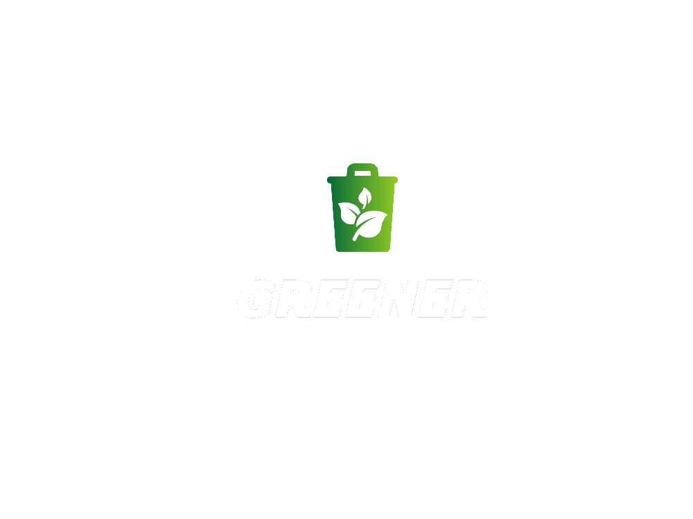

# Greener

<div id="top"></div>


<!-- PROJECT LOGO -->
<br />
<div align="center">
  <a href="https://github.com/SailenTT/ProgettoDispositiviMobili">
    
  </a>

  <h3 align="center">Greener</h3>

  <p align="center">
    A green app to keep you motivated and updated about your green side! minigames, eco-calendar, a semplificated carbon footprint and more!
    <br />
    <a href="https://github.com/SailenTT/ProgettoDispositiviMobili"><strong>Explore the docs »</strong></a>
    <br />
    <br />
    <a href="https://github.com/SailenTT/ProgettoDispositiviMobili">View Demo</a>
    ·
    <a href="https://github.com/SailenTT/ProgettoDispositiviMobili/issues">Report Bug</a>
    ·
    <a href="https://github.com/SailenTT/ProgettoDispositiviMobili/issues">Request Feature</a>
  </p>
</div>


<!-- ABOUT THE PROJECT -->
## About The Project


**Greener** is a project born and developed by 3 students attending the University of Insubria.
The idea comes from the common thought that, nowadays, there are more and more ways not to pollute or at least limit a part of it, but there are still people who, for one reason or another, find it hard to do their part.

This is where Greener comes in! the app, with its simplicity and intuitiveness, will allow the user to use it quickly and easily. 
But what does the app allow to do?

- Learn (even while having fun) what the green world is: through mini-games and quizzes with a green and eco background.
- Help you in the waste sorting! thanks to the calendar and its notifications, you will always be updated on the waste to throw away.
- Test yourself; with its simplified Carbon Footprint, it will tell you how low or high your ecological footprint is.
- And more (which we will let you discover..)

Thanks to the "Leaderboard" section you can also compare your scores with all the other users who choose to become part of the "Greener" world!.
<br>
<br>
<br>


<p align="right">(<a href="#top">back to top</a>)</p>


### Built With

Greener is an Android application developed in Kotlin, with the help of other programs and libraries:

* [Android Strudio](https://developer.android.com/studio)
* [Kotlin](https://developer.android.com/kotlin)
* [Figma](https://www.figma.com/)
* [Facebook API](https://developers.facebook.com/docs/)
* [Google API](https://cloud.google.com/apis)
* [Firebase](https://firebase.google.com/)
* [Material Design](https://material.io/design)


<p align="right">(<a href="#top">back to top</a>)</p>


<!-- GETTING STARTED -->
## Getting Started

<!--To install Greener on your device, you need to install the application from the .apk that you can find in the [release](https://github.com/silenTT/ProgettoDispositiviMobili) section of the repository.-->
To install Greener on your device, follow these steps to set up the project locally in your pc or in your work environment:

<!--Otherwise if you want to install this project locally in your pc or in your work environment, you have to:-->

### Prerequisites

Here you can read the pre-requirements you must meet in order to run this project locally:
* AVD (Android Virtual Device) or phisical device with Android API level 24 (Android 7.0 Nougat)

### Installation

There an example of the steps to follow in order to install and build the project on Android studio locally_:

1. Clone the repo
   ```sh
   git clone https://github.com/sailenTT/ProgettoDispositiviMobili/
   ```
2. Import "ProgettoDispositiviMobili/" folder in Android Studio

3. Download the file template <a href="https://gist.github.com/SailenTT/cea4c6609c779594f90b707dd8369f1d">secrets.xml</a> and put it into the folder res/values

4. Ask us for the API keys to put inside the file, otherwise you wouldn't be able to use Firebase, Google and Facebook services
   
3. Build project and enjoy!

<p align="right">(<a href="#top">back to top</a>)</p>


<!-- ROADMAP -->
## Roadmap

- [ ] Pass the exam with this project
- [ ] Translate the app in English
- [ ] Release the open beta
- [ ] and more to come...

See the [open issues](https://github.com/SailenTT/ProgettoDispositiviMobili/issues) for a full list of proposed features (and known issues).

<p align="right">(<a href="#top">back to top</a>)</p>


<!-- CONTRIBUTING -->
## Contributing

Contributions are what make the open source community such an amazing place to learn, inspire, and create. Any contributions you make are **greatly appreciated**.

If you have a suggestion that would make this better, please fork the repo and create a pull request. You can also simply open an issue with the tag "enhancement".
Don't forget to give the project a star! Thanks again!

1. Fork the Project
2. Create your Feature Branch (`git checkout -b feature/AmazingFeature`)
3. Commit your Changes (`git commit -m 'Add some AmazingFeature'`)
4. Push to the Branch (`git push origin feature/AmazingFeature`)
5. Open a Pull Request

<p align="right">(<a href="#top">back to top</a>)</p>


<!-- LICENSE -->
## License

Distributed under the MIT License. See `LICENSE.txt` for more information.

<p align="right">(<a href="#top">back to top</a>)</p>


<!-- CONTRIBUTORS -->
## Contributors

Cristian De Nicola - `Mat. 744954`

Cristian Arcadi - `Mat. 745389`

David Poletti - `Mat. 746597`

<h4 align="center">Special Thanks to:</h4>
<div align="center">
<a href="https://instagram.com/seed.otee.art">Alessandro Lorenzo Enrico Sidoti</a> and Giorgio Rigiroli for drawing most of the graphics props
</div>

<p align="right">(<a href="#top">back to top</a>)</p>


<!-- MARKDOWN LINKS & IMAGES -->
<!-- https://www.markdownguide.org/basic-syntax/#reference-style-links -->
[contributors-shield]: https://img.shields.io/github/contributors/othneildrew/Best-README-Template.svg?style=for-the-badge
[contributors-url]: https://github.com/othneildrew/Best-README-Template/graphs/contributors
[forks-shield]: https://img.shields.io/github/forks/othneildrew/Best-README-Template.svg?style=for-the-badge
[forks-url]: https://github.com/othneildrew/Best-README-Template/network/members
[stars-shield]: https://img.shields.io/github/stars/othneildrew/Best-README-Template.svg?style=for-the-badge
[stars-url]: https://github.com/othneildrew/Best-README-Template/stargazers
[issues-shield]: https://img.shields.io/github/issues/othneildrew/Best-README-Template.svg?style=for-the-badge
[issues-url]: https://github.com/othneildrew/Best-README-Template/issues
[license-shield]: https://img.shields.io/github/license/othneildrew/Best-README-Template.svg?style=for-the-badge
[license-url]: https://github.com/othneildrew/Best-README-Template/blob/master/LICENSE.txt
[linkedin-shield]: https://img.shields.io/badge/-LinkedIn-black.svg?style=for-the-badge&logo=linkedin&colorB=555
[linkedin-url]: https://linkedin.com/in/othneildrew
